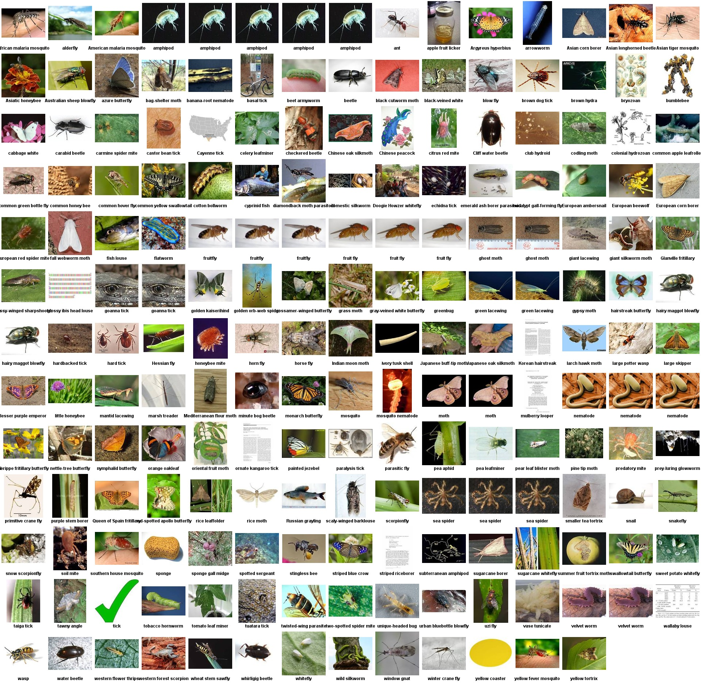

Genome
======

#### DNA analysis in Bash

Bash scripts for basic DNA analysis. Most scripts will accept data in [gbk](http://www.nmpdr.org/FIG/wiki/view.cgi/FIG/GBK) format. In `genomes` directory there are few samples of mitochondrial DNA records without any metadata.  `Weka` directory contains scripts that can come handy when classifying or clustering the data with Weka library (Java machine learning lib).

Picture represents a cluster of species, based on a mitochondrial dna.

List Of Scripts
---------------

### counter.sh
Counts the number of same bit occurrences in a row for every bit (ACGT).

### drawPlotGbkNoLegend.sh
Plots tmp[number] data from tmp folder. Looks for animal names in tmp/names.
USAGE: ./plotscript.sh "filenames" -> plots tmp1, tmp2 and tmp3
WARNING: Always use double quotes around filenames, even if you use regex

### drawPlotGbk.sh
Plots tmp[number] data from tmp folder. Looks for animal names in tmp/names.
USAGE: ./plotscript.sh "filenames" -> plots tmp1, tmp2 and tmp3

### drawPlot.sh
Plots tmp[number] data from tmp folder. Looks for animal names in tmp/names.
USAGE: ./plotscript.sh "1 2 3" -> plots tmp1, tmp2 and tmp3

### getAllCombos.sh
Outputs all combinations of adjecent characters of length $1
Reads from standard input

### getAllNames.sh
Prints all the species names from the gbk files in passed directory.

### getNameFromGbk.sh
Prints species name from the gbk file. Gbk file needs to be piped in.

### getGenFromGbk.sh
Prints only the gene sequence from the gbk file. File needs to be piped in.

### seq1.sh
deprecated
All combinations of four bits

### seq2.sh
deprecated
Four different bits

### seq3.sh
deprecated
Four bits without a repetition

### seqencer1.sh
deprecated

### seqencer2.sh
deprecated

### seqencer3.sh
deprecated

### seqencer4.sh
deprecated

### seqencer5.sh
USAGE: ./sequencer5.sh "1 2 3"

### seqencer6.sh
USAGE: ./sequencer5.sh "1 2 3" <no-of-chars-in-combinations> <optional-sed-query>
Run the query on files, numbered in first argument.
If combination doesn't exist, mark it 0.
Order by global frequency of combination.

### seqencerGbk2P1.sh
USAGE: ./<script-name>.sh "filenames" <no-of-chars-in-combinations> <results-folder>
WARNING: Always use double quotes around filenames, so they get
treated as single argument.
Only performs first part of operation and saves intermediate results
in ./comb<number-of-chars-in-comb> subfolder.
Run the query on files, numbered in first argument.
If combination doesn't exist, mark it 0.
Create dirs if they don't exist
	remove path from fName
	progress bar
 Remove duplicates from names file

### seqencerGbk2P2.sh
USAGE: ./<scriptname>.sh "filenames" <>
./sequencerGbk.sh "filenames" <no-of-chars-in-combinations> <optional-sed-query>
run the query on files, numbered in first argument
if combination doesn't exist, mark it 0
order by global frequency of combination
	progress bar
print all results side by side

### seqencerGbk2.sh
USAGE: ./sequencerGbk.sh "filenames" <no-of-chars-in-combinations> <optional-sed-query>
run the query on files, numbered in first argument
if combination doesn't exist, mark it 0
order by global frequency of combination
	progress bar

### seqencerGbk.sh
USAGE: ./sequencerGbk.sh "filenames" <no-of-chars-in-combinations> <optional-sed-query>
run the query on files, numbered in first argument
if combination doesn't exist, mark it 0
order by global frequency of combination
print all results side by side

### trimResults.sh
make results the same length

